# Logic Gate Simulator


**Prototypez des circuits logiques simplement et rapidement.**

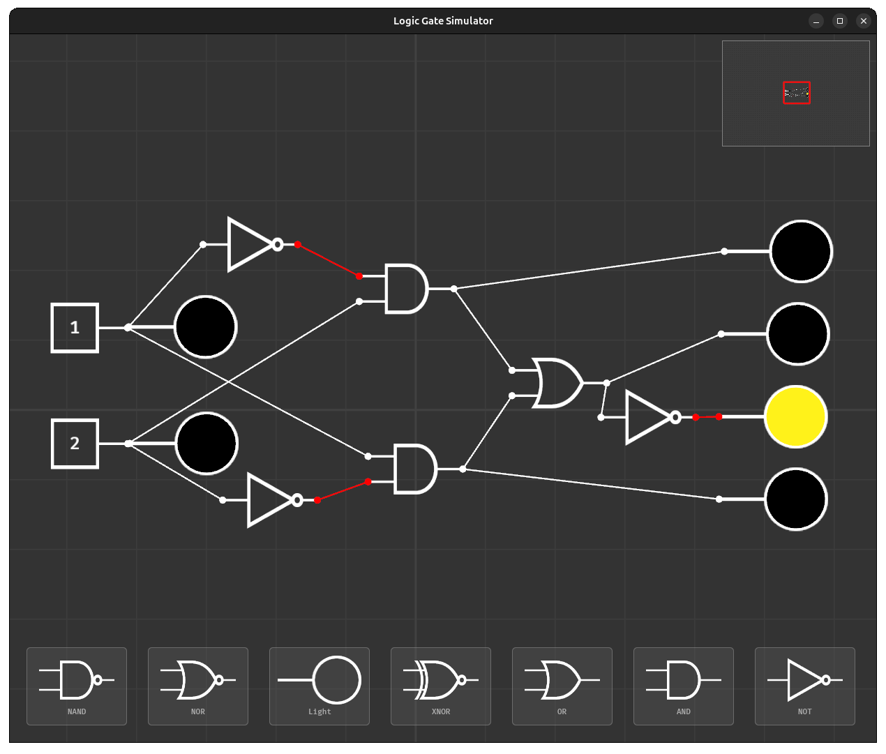
*Comparateur entre deux bits*

---

## 🧠 C'est quoi ?

**Logic Gate Simulator** est un outil visuel et interactif pour créer des circuits logiques sans écrire une seule ligne de code. Glissez des portes, reliez-les avec des fils, appuyez sur des touches — et observez les signaux se propager en temps réel.

Idéal pour :
- 🎮 Prototyper des mécaniques de jeu basées sur des conditions logiques
- 📐 Apprendre ou réviser l'électronique numérique
- 🧩 Résoudre des puzzles logiques
- 💡 Visualiser des systèmes de conditions complexes

---

## 🕹️ Contrôles

| Action                     | Contrôle                                                                |
| -------------------------- | ----------------------------------------------------------------------- |
| **Naviguer** dans la scène | Clic molette + glisser, ou `W` `A` `S` `D`                              |
| **Zoomer / Dézoomer**      | Molette de la souris                                                    |
| **Ajouter un item**        | Cliquer sur un item dans le menu du bas, puis le déposer sur la scène   |
| **Déplacer un item**       | Clic gauche + glisser sur l'item                                        |
| **Supprimer un item**      | Glisser l'item puis appuyer sur `Suppr`                                 |
| **Créer un fil**           | Clic gauche sur un nœud, puis clic gauche sur un autre nœud             |
| **Annuler un fil**         | Clic droit pendant la création d'un fil                                 |
| **Configurer une entrée**  | Double-clic sur une porte `Input`, puis appuyer sur la touche souhaitée |
| **Se repérer**             | La minimap en haut à droite reflète l'ensemble de la scène              |

---

## 📦 Les items disponibles

### 🔌 Input — Source de signal

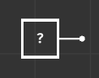

L'**Input** est votre source de signal. Liez-lui une touche du clavier : tant que vous maintenez cette touche, elle envoie un signal **1** (actif) à tout ce qui lui est connecté.

> **Double-cliquez** sur une porte Input pour entrer en mode configuration, puis appuyez sur la touche de votre choix.

---

### 💡 Light — Sortie lumineuse

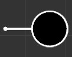

La **Light** est votre indicateur de résultat. Elle **s'allume en jaune** dès qu'elle reçoit un signal actif. C'est l'élément que vous observez pour savoir si votre circuit produit le résultat attendu.

---

### ⚙️ AND — ET logique

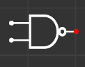

La porte **AND** n'émet un signal que si **toutes ses entrées** sont actives en même temps. Comme un interrupteur en série : les deux doivent être fermés pour que la lumière s'allume.

#### Table de vérité

| Entrée A | Entrée B | Sortie |
| :------: | :------: | :----: |
|    0     |    0     |   0    |
|    1     |    0     |   0    |
|    0     |    1     |   0    |
|    1     |    1     |   1    |

---

### ⚙️ OR — OU logique

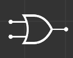

La porte **OR** émet un signal dès qu'**au moins une** de ses entrées est active. Comme deux interrupteurs en parallèle : l'un ou l'autre suffit.

#### Table de vérité

| Entrée A | Entrée B | Sortie |
| :------: | :------: | :----: |
|    0     |    0     |   0    |
|    1     |    0     |   1    |
|    0     |    1     |   1    |
|    1     |    1     |   1    |

---

### ⚙️ NOT — Inverseur

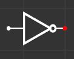

La porte **NOT** **inverse** le signal qu'elle reçoit. Si l'entrée est active, la sortie ne l'est pas — et inversement. Une seule entrée, une seule sortie.

#### Table de vérité

| Entrée | Sortie |
| :----: | :----: |
|   0    |   1    |
|   1    |   0    |

---

### ⚙️ NAND — NON-ET

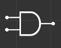

La porte **NAND** est l'inverse exact de la AND : elle émet un signal dans **tous les cas, sauf** si toutes ses entrées sont simultanément actives. C'est la porte universelle — on peut construire n'importe quel circuit logique uniquement avec des NAND.

#### Table de vérité

| Entrée A | Entrée B | Sortie |
| :------: | :------: | :----: |
|    0     |    0     |   1    |
|    1     |    0     |   1    |
|    0     |    1     |   1    |
|    1     |    1     |   0    |

---

### ⚙️ NOR — NON-OU

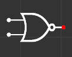

La porte **NOR** est l'inverse de la OR : elle n'émet un signal que si **aucune** de ses entrées n'est active. Dès qu'une seule entrée s'active, la sortie s'éteint.

#### Table de vérité

| Entrée A | Entrée B | Sortie |
| :------: | :------: | :----: |
|    0     |    0     |   1    |
|    1     |    0     |   0    |
|    0     |    1     |   0    |
|    1     |    1     |   0    |

---

### ⚙️ XOR — OU exclusif

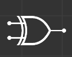

La porte **XOR** émet un signal uniquement si **exactement une** de ses entrées est active — pas les deux en même temps. C'est le "l'un ou l'autre, mais pas les deux".

#### Table de vérité

| Entrée A | Entrée B | Sortie |
| :------: | :------: | :----: |
|    0     |    0     |   0    |
|    1     |    0     |   1    |
|    0     |    1     |   1    |
|    1     |    1     |   0    |

---

### ⚙️ XNOR — NON-OU exclusif

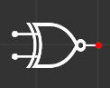

La porte **XNOR** est l'inverse de la XOR : elle émet un signal si ses deux entrées sont **dans le même état** (toutes les deux actives, ou toutes les deux inactives). C'est un détecteur d'égalité.

#### Table de vérité

| Entrée A | Entrée B | Sortie |
| :------: | :------: | :----: |
|    0     |    0     |   1    |
|    1     |    0     |   0    |
|    0     |    1     |   0    |
|    1     |    1     |   1    |

---

## 🗺️ Minimap

La **minimap** dans le coin supérieur droit vous donne une vue d'ensemble de tout votre circuit. Cliquez directement dessus pour naviguer instantanément vers n'importe quelle zone de la scène.

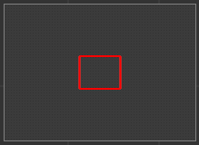

---

## 💭 Exemples de circuits

### Comparateur de deux bits (Y et H)

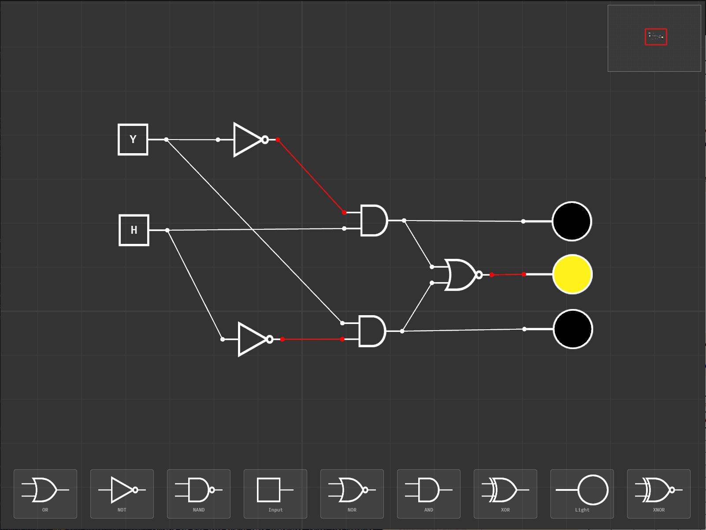

Les sorties 1, 2, 3 représentent respectivement de haut en bas le cas où Y < H, Y = H et Y > H.

#### Table de vérité

| Entrée Y | Entrée H | Sortie Y < H | Sortie Y = H | Sortie Y > H |
| :------: | :------: | :----------: | :----------: | :----------: |
|    0     |    0     |      0       |      1       |      0       |
|    1     |    0     |      0       |      0       |      1       |
|    0     |    1     |      1       |      0       |      0       |
|    1     |    1     |      0       |      1       |      0       |

--- 

## 📋 feuille de route

- Nommer des elements
- Importer/exporter
- Faire des files rectangulaires

---

## 🚀 Lancer l'application

```
cargo run
```

> Aucune configuration requise. Lancez et commencez à construire.

---

<div align="center">Made with ❤️ and Rust 🦀</div>
